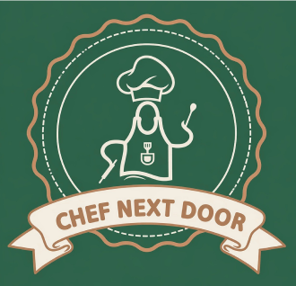
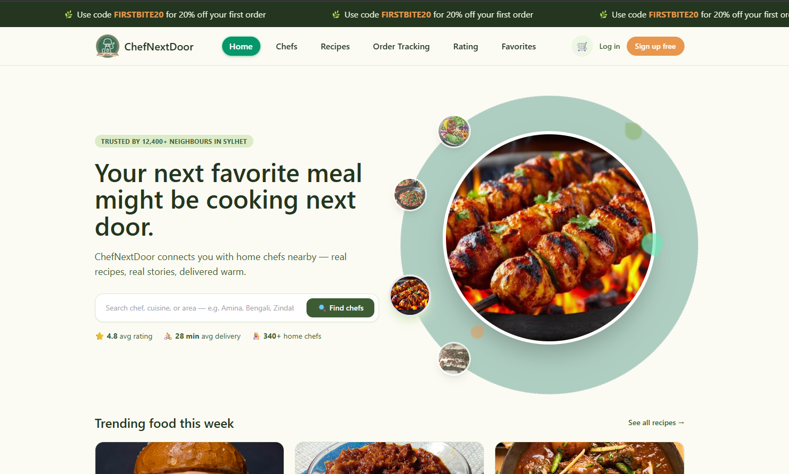
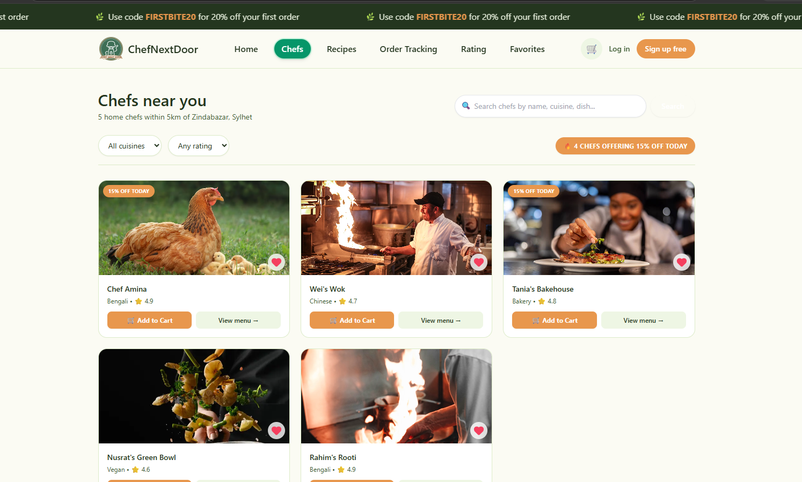
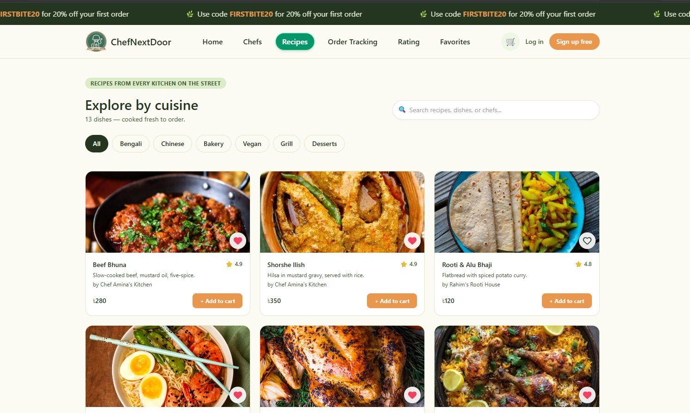
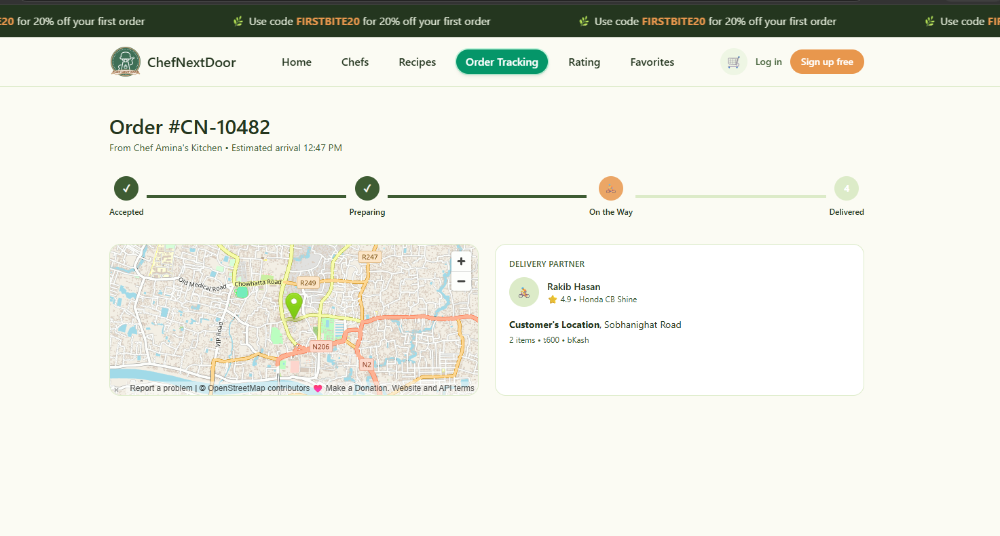
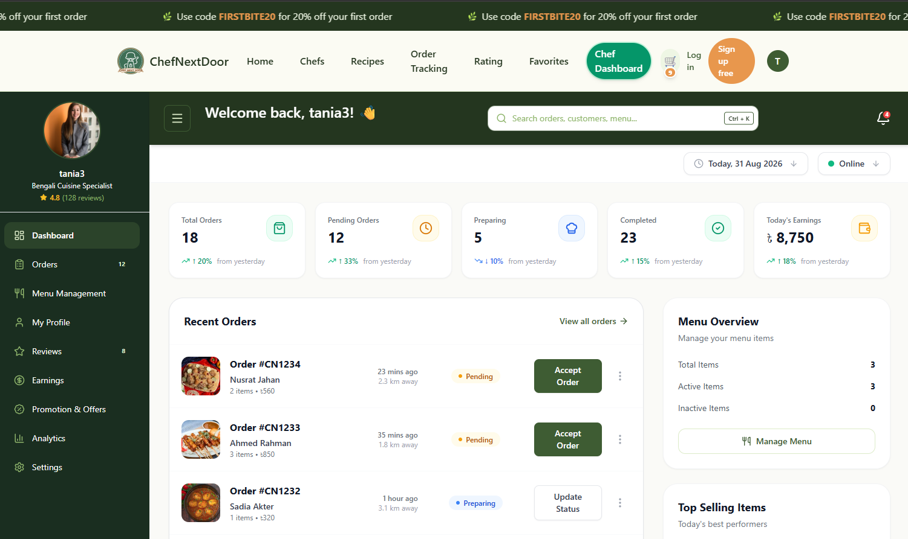

<div align="center">
  
  <h1>ChefNextDoor</h1>
</div>

ChefNextDoor is a modernized, full-stack web application designed to connect food lovers with talented local home chefs. Customers can easily discover nearby culinary experts, browse homemade menus, place orders, and track their deliveries in real-time. On the other side, chefs get a dedicated dashboard to manage their digital kitchen, process incoming orders, and track their revenue. Everything is overseen by a powerful Admin Panel for platform moderation and business analytics.

Originally conceptualized as a PHP backend project, ChefNextDoor has been completely re-engineered as a modern, high-performance **Next.js and Supabase** application.

---

## ✨ Features

### 🛒 Customer Experience
* **Secure Authentication:** Easy sign-up and login powered by Supabase Auth.
* **Discover Local Chefs:** Browse verified home chefs and explore their custom menus.
* **Shopping Cart & Checkout:** Intuitive add-to-cart functionality with real-time subtotal calculations.
* **Live Order Tracking:** Real-time status updates from the kitchen to your door (no manual refreshing needed!).
* **Ratings & Reviews:** Leave feedback on your meals, directly impacting a chef's community rating.
* **Profile Management:** Manage delivery addresses, view order history, and update personal details.
* **Favorites System:** Bookmark your favorite dishes to quickly order them again later.
* **Dynamic Delivery Fees:** Real distance-based delivery fee calculations using OpenStreetMap Geocoding.

### 👨‍🍳 Chef Workspace
* **Dedicated Onboarding:** Specialized registration flow for aspiring chefs (requires admin approval).
* **Kitchen Dashboard:** A centralized hub displaying active orders, total revenue, and performance metrics.
* **Menu Management:** Full CRUD capabilities for adding dishes, pricing, and uploading appetizing food photography.
* **Order Fulfillment Pipeline:** One-click status updates to move orders from *Pending* -> *Preparing* -> *Delivered*.
* **Chef Profile:** Customize your public storefront with a bio, specialty cuisines, and profile picture.
* **Earnings Breakdown:** Track gross sales, deduct platform fees automatically, and view net take-home earnings.
* **Availability Toggling:** Quickly toggle dish availability based on your current ingredient inventory.

### 🛡️ Admin Control Panel
* **Platform Oversight:** A dedicated `/admin/dashboard` separate from the customer application.
* **Key Metrics Dashboard:** Real-time visualizations of Total Revenue, Total Orders, Customer Growth, and Trending Items.
* **Chef Moderation:** Approve, suspend, or reject incoming chef applications to maintain quality control.
* **Order Management:** Global view of all active orders across the platform with the ability to override statuses.
* **Revenue Analytics:** Comprehensive step-charts visualizing platform growth and sales trends.
* **User Management:** Ability to suspend or reactivate misbehaving customer accounts.
* **Delivery Partner Management:** Perform CRUD operations on delivery personnel across the platform.

---

## 🛠️ Tech Stack

| Layer | Technology |
|---|---|
| **Frontend Framework** | Next.js 14 (App Router), React, TypeScript |
| **Styling & UI** | Tailwind CSS, Lucide React (Icons) |
| **Backend & Database** | Supabase (PostgreSQL) |
| **Authentication** | Supabase Auth (Email/Password) |
| **File Storage** | Supabase Storage (Profile & Menu Images) |
| **Realtime Updates** | Supabase Realtime (Order Tracking) |
| **Testing** | Jest, Deno Test (for backend patterns) |

---

## 📂 Project Structure

```text
ChefNextDoor/
├── frontend/                     # Next.js Application (TypeScript)
│   ├── app/                      
│   │   ├── (customer)/           # Customer views: tracking, dashboard, chefs
│   │   ├── (admin)/              # Standalone admin dashboard & moderation
│   │   ├── auth/                 # Login and registration flows
│   │   └── api/                  # Next.js API route handlers
│   ├── components/               # Reusable React components (UI, layout)
│   ├── lib/                      # Core business logic and Supabase clients
│   └── public/                   # Static assets and logo
├── supabase/                     # Backend Infrastructure
│   ├── migrations/               # PostgreSQL schema & Row Level Security policies
│   ├── functions/                # Deno Edge Functions and Shared Patterns
│   └── tests/                    # Unified test suite (API, Services, Patterns)
├── Testing.md                    # Detailed documentation on test coverage
└── design-patterns.md            # Write-up of software design pattern usage
```

---

## 🗄️ Database Schema

The platform relies on a robust PostgreSQL database hosted on Supabase. The database consists of interconnected tables managing Profiles, Chefs, Menus, Orders, and Reviews. 

All tables, relationships, and Row Level Security (RLS) policies are completely version-controlled. You can find the complete schema definition in `supabase/migrations/0001_init.sql`.

---

## 🧩 Design Patterns

To ensure the codebase remains scalable, maintainable, and robust, ChefNextDoor implements several GoF Design Patterns natively in TypeScript and Deno:

1. **Singleton Pattern:** Used to manage a single, thread-safe instance of the Supabase Client to prevent memory leaks during edge function invocations.
2. **Facade Pattern:** Simplifies the complex checkout and order-placement subsystem into a single `OrderFacade.placeOrder()` method.
3. **Factory Pattern:** Dynamically constructs user profiles (`Customer` vs `Chef`) based on the registration role, enforcing strict schema requirements.
4. **Strategy Pattern:** Encapsulates different payment processing algorithms (e.g., Cash on Delivery vs. bKash).
5. **Observer Pattern:** Implements an event-driven architecture to dispatch email and push notifications whenever an order status changes.

*Read the full deep-dive in [design-patterns.md](./design-patterns.md).*

---

## 🧪 Testing

ChefNextDoor features a comprehensive, centralized automated testing suite covering over 90% of the backend logic.

* **Backend Tests (Deno):** Tests the core design patterns and Edge Function logic in complete isolation.
* **Frontend Tests (Jest):** Tests API wrappers, Context API state management, and React UI controllers.

To run the backend tests:
```bash
deno test supabase/tests/design_patterns/
```

To run the frontend tests:
```bash
cd frontend
npm run test
```
*Read the full coverage report in [Testing.md](./Testing.md).*

---

## 📸 Screenshots

| Landing Page | Chef Profile | Recipes |
|:---:|:---:|:---:|
|  |  |  |

| Order Tracking (Live) | Chef Dashboard | Admin Panel |
|:---:|:---:|:---:|
|  |  |  |

---

## 🚀 Getting Started

### Prerequisites
* **Node.js** (v18 or higher)
* A free **Supabase** account and project

### 1. Database Setup
1. Open your Supabase project dashboard and navigate to the **SQL Editor**.
2. Copy the contents of `supabase/migrations/0001_init.sql` and run it. This will automatically generate all tables, enums, and required relationships.

### 2. Frontend Setup
Navigate into the frontend directory and install dependencies:
```bash
cd frontend
npm install
```

Configure your environment variables:
```bash
cp .env.example .env.local
```
*Make sure to paste your `NEXT_PUBLIC_SUPABASE_URL` and `NEXT_PUBLIC_SUPABASE_ANON_KEY` into `.env.local`.*

Start the development server:
```bash
npm run dev
```
The application will now be running on `http://localhost:3000`.

---

## 🏗️ Architecture Note

Unlike traditional monoliths that rely on a heavy backend framework (like Spring Boot or Laravel) to serve a REST API, **ChefNextDoor is entirely serverless**. 

The Next.js frontend communicates directly with the Supabase PostgreSQL database. Security is not enforced by a middleware API layer, but rather natively at the database level using **Row Level Security (RLS)**. This ensures that customers can only read their own orders, and chefs can only modify their own menus, resulting in a lightning-fast, highly secure architecture.
