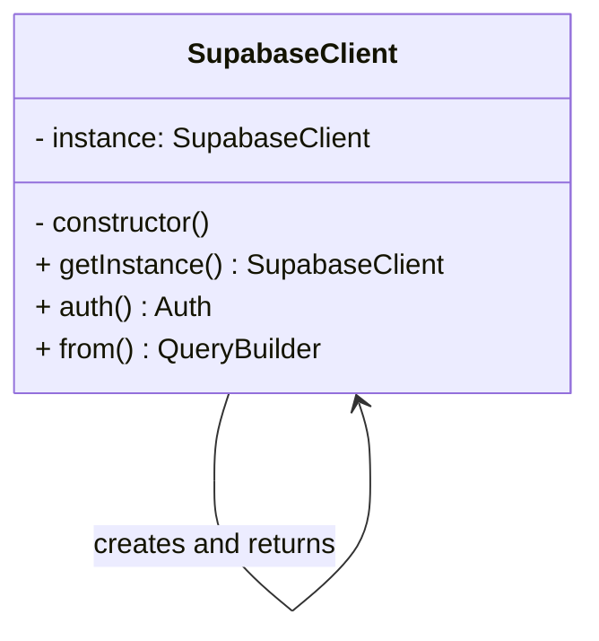
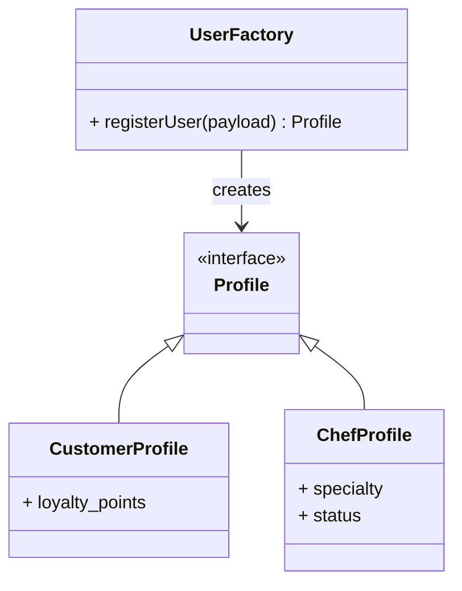
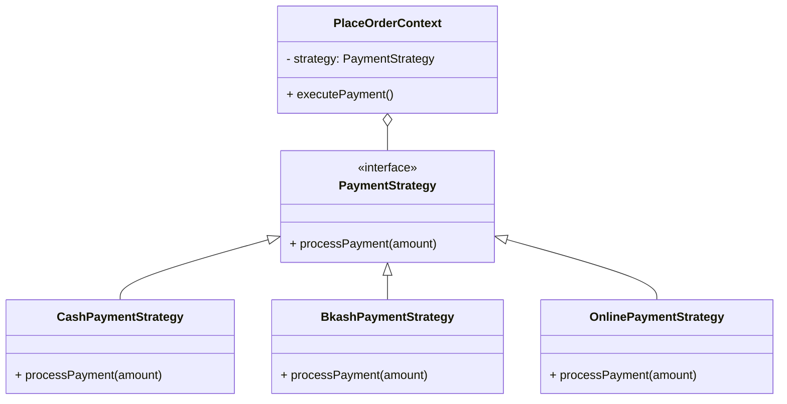
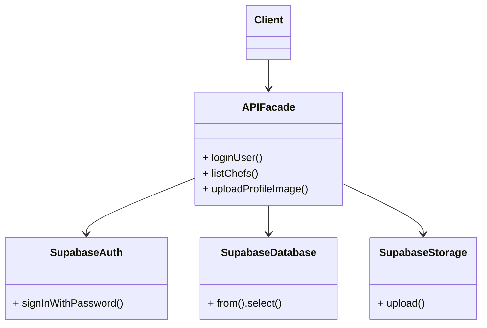
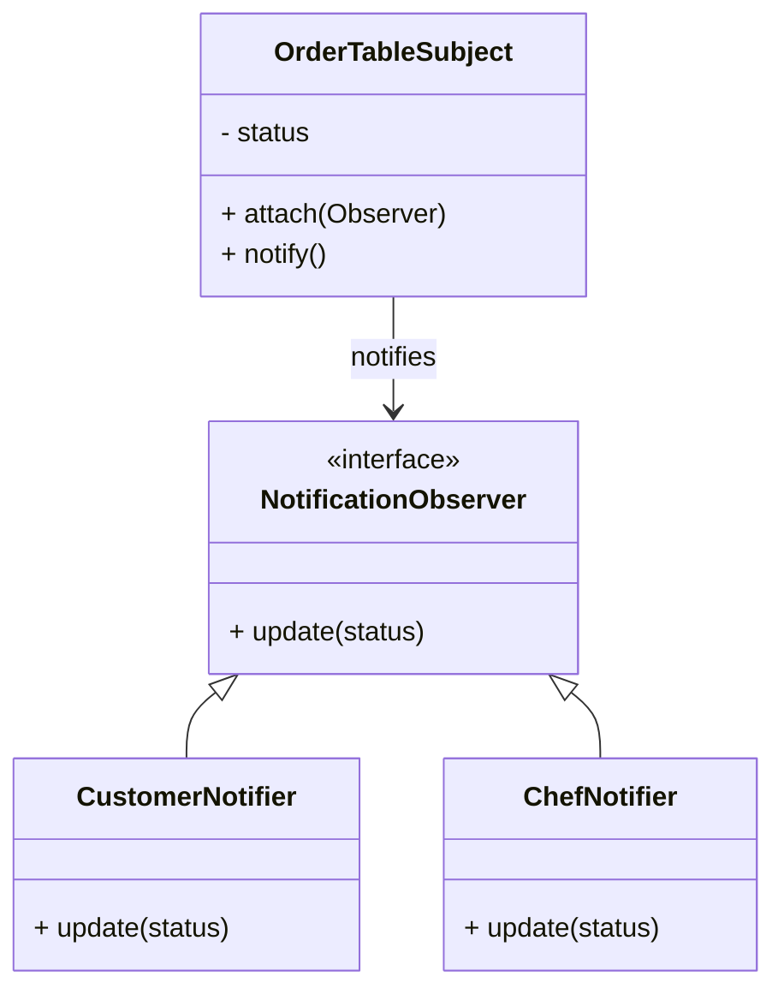

# 🧩 Design Patterns
ChefNextDoor

This document presents the five software design patterns used in the development of the ChefNextDoor application and explains their implementation and purpose.

The patterns are:
1. Singleton Pattern
2. Factory Method Pattern
3. Strategy Pattern
4. Facade Pattern
5. Observer Pattern

Each design pattern provides a clear structure for managing different parts of the application, making the code more organized, flexible, and easier to develop.

## 1. Singleton Pattern
### Problem
The application needs to interact with the Supabase backend (database, auth, storage, and edge functions). Instantiating multiple instances of the Supabase client across different components would lead to redundant network connections, increased memory usage, and inconsistent state management (especially for authentication).

### Solution
The Singleton Pattern is used to ensure that only a single instance of the Supabase client is created and shared across the entire frontend application.

### Implementation
The implementation is located at:
`frontend/lib/supabaseClient.ts`

The single client instance is created and exported:
```typescript
export const supabase = createClient(supabaseUrl, supabaseAnonKey);
```

Any file in the application requiring backend access imports this shared instance.

### Benefits
- Ensures a single, consistent connection pool to Supabase.
- Reduces memory consumption by preventing duplicate client instances.
- Simplifies authentication state management.
- Provides a single point of configuration for the backend URL and API keys.

### UML Diagram
**Singleton Pattern**


## 2. Factory Method Pattern
### Problem
The application supports multiple user roles (Customer, Chef, Admin, Delivery Partner). When a new user registers, the system must not only create an authentication account but also insert a corresponding profile record into the correct role-specific database table (e.g., `tbl_customer`, `tbl_chef`). Duplicating this conditional logic throughout the UI would be unmaintainable.

### Solution
The Factory Method Pattern is used to centralize role-specific user creation. The registration process goes through a dedicated Edge Function which determines the user's role and instantiates the correct profile records in the same request.

### Implementation
The primary API interface is in `frontend/lib/api.ts` (the `registerUser` function), which delegates to the `register-user` Edge Function.

The creation flow is:
```
New Auth User
     │
     ▼
register-user (Edge Function Factory)
     │
     ├── Customer (tbl_customer)
     ├── Chef (tbl_chef)
     └── Delivery Partner (tbl_delivery_partner)
```

### Benefits
- Centralizes user profile creation.
- Eliminates duplicated role-specific creation logic on the frontend.
- Ensures atomic operations (auth and profile are created together).
- Makes it easy to add new roles in the future.

### UML Diagram
**Factory Method Pattern**


## 3. Strategy Pattern
### Problem
The application supports different payment methods (Cash, Online, bKash) for placing an order. Hardcoding the logic for each payment method directly within a single massive order processing function would make the code difficult to maintain and extend when new payment gateways are introduced.

### Solution
The Strategy Pattern is used to encapsulate different payment processing algorithms. The system determines the payment method at checkout and routes the processing through the appropriate strategy via the Edge Function.

### Implementation
The frontend triggers this via `frontend/lib/api.ts` in the `placeOrder` function, which invokes the `place-order` Edge Function. The Edge Function acts as the context, applying the appropriate payment handling strategy (Cash, Online, or bKash) depending on the payload.

### Benefits
- Separates payment processing logic.
- Reduces conditional complexity (if/else chains) in the core order logic.
- Makes it easy to introduce new payment methods without modifying existing code.
- Keeps the frontend unaware of payment processing implementation details.

### UML Diagram
**Strategy Pattern**


## 4. Facade Pattern
### Problem
Interacting with Supabase requires managing different sub-services: Database (PostgREST), Auth, Storage, and Edge Functions. Direct usage of these services within React components would clutter the UI layer with complex data fetching, error handling, local storage fallbacks, and storage bucket path management.

### Solution
The Facade Pattern provides a simplified, high-level interface that hides the complexities of the underlying Supabase architecture. The React components only interact with this unified API.

### Implementation
The implementation is located at:
`frontend/lib/api.ts`

This file acts as a Facade, providing clean methods such as:
- `loginUser(email, password)` (handles Supabase Auth and local fallbacks)
- `listChefs()` (handles database queries)
- `uploadProfileImage(userId, file)` (handles Storage bucketing and public URL retrieval)

### Benefits
- Simplifies complex backend operations for the frontend components.
- Hides the underlying SDK and fallback coordination.
- Centralizes error handling and local storage mock logic.
- Makes the UI components significantly cleaner and easier to test.

### UML Diagram
**Facade Pattern**


## 5. Observer Pattern
### Problem
When an order's status changes (e.g., from "Pending" to "Preparing"), multiple parts of the system need to react. Specifically, a notification must be sent to the Customer, the Chef, and potentially the Delivery Partner. Placing this notification logic tightly coupled to every order update query would cause data inconsistencies and bloated application code.

### Solution
The Observer Pattern allows secondary operations (like notifications) to react to state changes without being explicitly called by the core update operation. In this project, it is implemented at the database level via triggers, and at the frontend layer via real-time subscriptions.

### Implementation
**Database Layer:**
Located in `supabase/migrations/0001_init.sql`.
The trigger `trg_order_status_notify` observes changes on the `tbl_order` table. When the status changes, the `fn_notify_order_status_change()` function fans out notifications to the relevant parties automatically.

**Frontend Layer:**
Located in `frontend/lib/api.ts` (`subscribeToOrder`).
The React client observes live changes to the database using Supabase Realtime channels.

### Benefits
- Separates core order processing from side effects (notifications).
- Guarantees notifications are created regardless of how the order was updated.
- Reduces coupling between different application features.
- Provides real-time UI updates automatically.

### UML Diagram
**Observer Pattern**


## Pattern Summary

| Pattern | Purpose | Main Implementation |
|---------|---------|---------------------|
| **Singleton** | Shares a single Supabase client instance | `frontend/lib/supabaseClient.ts` |
| **Factory Method** | Centralizes role-specific user creation | `frontend/lib/api.ts` (register-user) |
| **Strategy** | Encapsulates payment/processing variations | `frontend/lib/api.ts` (place-order) |
| **Facade** | Simplifies backend coordination for the UI | `frontend/lib/api.ts` |
| **Observer** | Reacts to order status changes | `supabase/migrations/0001_init.sql` (trigger), `api.ts` |

